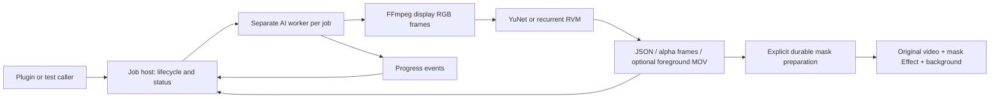

# Selects AI Runtime PoC

A shared external runtime for `faces.detect` (YuNet) and `person.matte` (RVM), exercised on macOS arm64 and Windows x64. Windows DirectML and CPU execution use Selects' embedded Node; Mac WebGPU uses a pinned plugin-owned standalone Node to avoid Electron/Dawn mapped-buffer incompatibility. The task and job contracts are shared. Python and a globally installed Node are not runtime requirements.

The source package registers an external runtime with Selects host 2.0.560 or newer, the first shipping AI host. Its preparation entrypoint provisions pinned native dependencies and original models without global Node or Python. The AI Test Lab panel consumes the public `selects.ai` SDK; it contains no inference engine or shell launcher. The app integration is developed separately from this package. `scripts/job-host.cjs` remains a standalone verification harness. See [VALIDATION.md](VALIDATION.md) for measured scope and [INSTALL.md](INSTALL.md) for setup and platform requirements.

## Responsibilities

- The runtime owns model verification, task-specific preprocessing, inference, postprocessing and output schemas.
- The host owns the workflow ID, process lifecycle, status persistence and tree cancellation. `scripts/job-host.cjs` demonstrates lifecycle supervision with an explicit job deadline; that deadline is a harness option, not an app inference timeout.
- The Selects adapter resolves a Resource ID to authorized input media, adopts result files into persistent storage and forwards progress to the workflow UI. The internal CLI receives an already resolved absolute `source.path`; plugin SDK requests use Resource IDs.

Successful results are file-backed. `faces.json` contains display-pixel boxes, five landmarks and actual source timestamps. `matte.json` references one full-size grayscale 8-bit image per decoded frame. PNG is the compatible default; AVIF is an explicit compact, lossy encoding on a supporting host. Both store independent files without an archive or a temporal video decoder. The Lab requests these masks without a foreground MOV, prepares durable host-owned mask files, and layers a masked original-video Effect over a background image. The original Main audio remains in the editable Draft. Explicit foreground-video mode remains available to other consumers; it writes a straight-alpha ProRes 4444 MOV from RVM foreground and alpha tensors. The mask Effect uses original source RGB, which can differ from RVM's corrected foreground colors at soft edges.

## Important behavior

Each job uses a caller-supplied fresh empty output folder; callers must choose distinct folders for concurrent jobs. JSONL progress is observable independently of inference. A job is successful only after output validation, persisted result creation and worker exit. Cancellation requested before the host commits a terminal status wins over late worker success: the host suppresses the result and removes its success payload. IPC abort and a tree-kill backstop stop the worker and decoder; partial files may remain, but are not successful results. A dead host is reconciled to `interrupted` unless a complete result was already committed; cancellation intent takes precedence during recovery. No automatic rerun or resume is performed.

RVM initializes its recurrent state at the beginning of the requested interval and preserves it in timestamp order within that job. Seeking, parallelizing frames or splitting intervals changes its history and is not equivalent to one continuous run. New Main-managed matte jobs default to `auto`: Windows probes DirectML; prepared macOS ARM64 runtimes probe WebGPU on an Apple Metal hardware adapter; other or incompatible hosts use CPU. DirectML and the private CoreML experiment use first-frame ORT kernel profiles. WebGPU verifies GPU-resident outputs and finite alpha/recurrent tensors using a GPU reduction, reading one flag while retaining recurrent state on GPU. Its ORT kernel placement is not profiled. An initial failed auto probe is disposed and CPU restarts from zero state on the same frame. Later failures fail the job without changing its recurrent history. Explicit CPU skips probing; an explicit DirectML failure remains a failure. Existing CPU journals keep their provider and retry identity. `enableCoreMlAuto: true` remains a private CoreML experiment override. GPU availability is not a guarantee of lower total time; short jobs can be dominated by initialization and mask writing.

The process boundary provides lifecycle separation, not an operating-system security sandbox. The Selects host accepts jobs into one FIFO preparation/inference slot; the standalone harness does not schedule across callers. This prototype has no untrusted-code isolation, quota enforcement or production output garbage collection. It limits one source raster to 32 million pixels, selected frames to 20,000, runtime metadata to 64 MiB and worker event lines to 256 KiB. The app host adopts/reads primary JSON only up to 8 MiB. It probes the entire source timeline and decodes from the beginning; long-source seek/probe optimization remains future work.

## Next product validation

1. Validate provisioning and native loading in signed release builds and on fresh OS installations, including Windows VC++ prerequisites.
2. Validate signed binary provisioning and unlocked Windows native live preview. Mac composite preview/export and Windows installed-app composite export with source audio have passed; precise scope is in VALIDATION.md.
3. Validate independent AVIF masks on varied footage and long media, including edge quality and generation time. The Mac all-intra encoder checkpoint retains 9.66 MB of AVIF contents / 11.92 MB of filesystem allocation for one FHD minute. The older encoder measured 9.05 / 11.80 MB, versus 63.68 / 66.67 MB for its lossless PNG control. This is lossy opacity compression with a measured speed/size/error tradeoff, not a general size ceiling; decoded-raster memory is unchanged. Durable-asset garbage collection remains separate.
4. Validate the migrated Podcast Hook Captions consumer through its complete paid reel workflow and Windows UI; its real Mac face/tracking/framing stage and portable tests are verified.

[CONTRACT.md](CONTRACT.md) documents the current wire contract. [THIRD_PARTY.md](THIRD_PARTY.md) records model and dependency provenance. The source package does not distribute models, native dependencies, fixtures or generated outputs.

## Try the PoC panel

Open **AI Test Lab** from Selects' Apps list in an AI-capable host (2.0.560 or
newer). The panel follows the app language and supports Korean and English.

Choose **Find faces** or **Remove background** at the top. Each keeps its own
video selection, duration, job and result. Switching modes does not cancel or
replace the other task; the host queues accepted work in its single local slot.

- **Find faces:** choose a Project video, start with two seconds, then click
  Find faces. The result shows a detection count and one coordinate diagram.
  Additional samples and technical information are in Details. These are
  detector coordinates, not source photographs.
- **Remove background:** choose a Project video and click Remove background.
  When it finishes, choose a Project background image and click Open in editor.
  This prepares the saved masks, creates a background layer and a masked copy
  of the original video, and opens the editable Draft. It creates no foreground
  MOV. The original Main audio is retained. This requires the existing video
  Effect authoring capability in addition to the AI-capable host. A new task
  chooses independent AVIF files when the host's `supportedMatteEncodings`
  advertises AVIF; older hosts keep PNG without receiving a new submit option.
  Existing saved requests and jobs keep their original format. The panel adds
  no format setting and does not combine masks into an archive.

Use the Project Add action to add your own videos and background images; the
lists update automatically. Cancel is shown while a job is active. Details
contains the workflow identity, refresh and recovery controls when applicable.
Closing the panel does not cancel accepted inference. If a Draft acknowledgment
is uncertain, the next result action inspects its saved outcome instead of
blindly repeating the write.

Saved Drafts remain openable even if their AI job is no longer available.
Mask preparation requires verified artifact hashes and an exact source window;
older jobs without that evidence must be rerun explicitly. Changing the editor
background does not rerun the model. Seek, trims and splits select cached masks
with the Effect's source clock. Playback and export support remain subject to
the host's existing video Effect renderer.

Inference runs locally. The first request can download the pinned model and
native dependencies. Final export uses the existing Selects Export flow.

Useful feedback includes the source file, chosen function and duration, whether
the result is visually acceptable, how long it took, and any displayed error.
Keep the workflow ID from Details when reporting a job issue.

If the development preview shows a zero duration after opening a Draft, bring
the editor forward, open another saved Draft, and return. If a Panel refresh
reports a reconnect error, refresh the saved job from Details.
